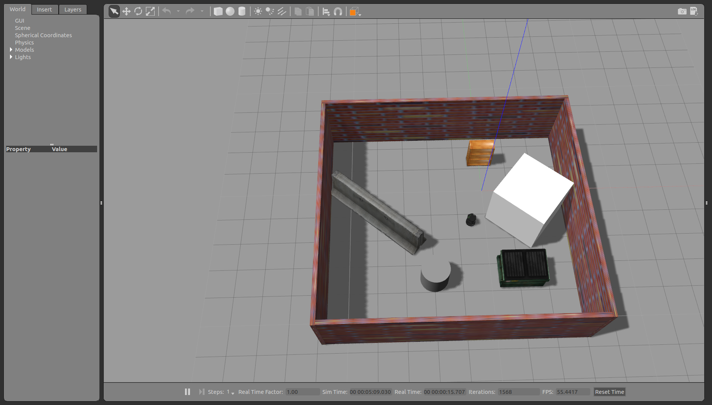

<h1 align="center"> Roomba Walker: A simulation of a roomba type robot</h1>
ENPM808x-Programming Assignment - Working with Gazebo

[](https://opensource.org/licenses/BSD-3-Clause)
---

## Introduction

This is a simulation of a roomba type house cleaning robot, simulated on a turtlebot robot in a gazebo environment in a custom world. The turtleWalker class implemented in C++ takes the input as laser scan from the kinect sensor mounted on the turtlebot.


## Dependencies

This package has been tested in a system with following dependencies.
- Ubuntu 16.04 LTS
- ROS-Kinetic distro
- Gazebo 7+
- Turtlebot simulator

## Build nstructions

1) To install ROS-Kinetic follow the steps mentioned in the official website (http://wiki.ros.org/kinetic/Installation/Ubuntu)

2) To install gazebo for ros kinetic run the following sommand in a terminal
```
sudo apt-get install ros-kinetic-gazebo-ros-pkgs ros-kinetic-gazebo-ros-control
``` 
3) To install `turtlebot_sumulator` package, run the following commands in a terminal window.
```
sudo apt-get install ros-kinetic-turtlebot-gazebo 
ros-kinetic-turtlebot-apps ros-kinetic-turtlebot-rviz-launchers
``` 

4) After installing the required dependencies run the following commands to download this project.
```
source /opt/ros/kinetic/setup.bash
mkdir -p ~/catkin_ws/src
cd ~/catkin_ws/src/
git clone https://github.com/sandeep-kota/Roomba_Walker.git
cd ../ 
catkin_make
```

## Run Instructions

1) To launch the program and simulation world in the custom world run the following commands in a terminal.
```
cd ~/catkin_ws/
source devel/setup.bash
roslaunch turtlebot_walker turtle.launch rosbagRecorder:=false
# Set rosbagRecorder argument value to true to record a bag file for 15 seconds
```
A window similar to this hould open if the instructions are followed properly.
	<p align = "center">
		
	</p>

2) To replay the recorded rosbag file, we will execute the `rosbag play	` command. It is to be noted that all existing terminals should be closed before running the `rosbag` play command. To close a terminal window press`CTRL+C` in that window.
```
# Run roscore in a separate terminal
roscore
```
```
cd ~/catkin_ws/
source devel/setup.bash
cd ~/catkin_ws/src/Roomba_Walker/results/
rosbag play recorder.bag 
```

## LICENSE
This project is released under the 3-clause BSD License.
